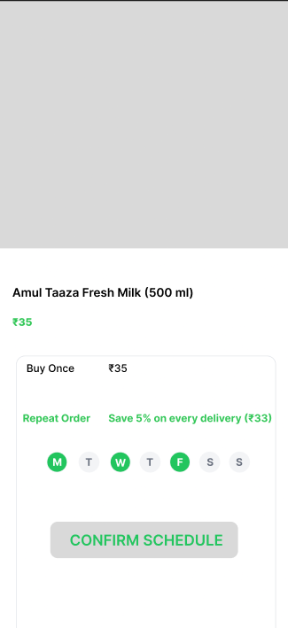

# Zepto/Blinkit "Repeat" — Hyperlocal Micro-Subscription Feature Portfolio

## 🚀 1. Executive Summary
In the hyper-competitive Indian Quick Commerce (Q-Commerce) landscape, platforms excel at fulfilling instant, high-intent impulse purchases but struggle with long-term user retention on daily household staples (milk, eggs, bread). Consumers exhibit highly fluid loyalty, routinely switching between platforms based on immediate slot availability or marginal discount differences at 7:00 AM. 

**"Repeat"** is a low-friction, micro-subscription product feature designed to automate recurring purchases of high-frequency items directly from the existing interface. By utilizing predictive hyperlocal dark store inventory reservation and integrated UPI Autopay mandates, the feature locks in a guaranteed wallet share of the user's daily household budget while optimizing morning fulfillment supply chains.

---

## 🎯 2. Problem Statement & User Personas

### The Core Problem
Manual re-ordering of daily essential stock keeping units (SKUs) creates repetitive digital friction. If a consumer forgets to order staples the night before, peak morning demand windows (7:00 AM – 9:00 AM) often lead to stockouts or prolonged delivery times, causing the user to abandon the platform for local physical vendors or immediate competitors.

### User Personas

| Persona Profile | Behavioral Traits | Core Pain Points |
| :--- | :--- | :--- |
| **The Routine Provider**  *(e.g., Working Parent / Homemaker)* | • High-frequency, predictable buyers. • Manually orders dairy, bread, and fresh produce every 48 hours. | • High fatigue from repetitive ordering. • Suffers when essentials are out of stock during the breakfast prep window. |
| **The Friction-Averse Professional**  *(e.g., Urban Bachelor / Digital Native)* | • High tech usage; chaotic, low-planning schedules. • Relies entirely on instant delivery apps. | • Forgets to inventory the kitchen until essentials run out completely. • Frustrated by paying individual delivery fees on single-item staple orders. |

---

## 🛠️ 3. Functional Requirements & Core User Flow

### 3.1 Seamless Subscription Discovery (UI/UX Layer)
* **Contextual Toggle:** Eligible high-frequency SKUs will feature a prominent `"Repeat this item"` widget directly on the Product Details Page (PDP) and within the active Checkout Cart checkout funnel.
* **Micro-Scheduler UI:** Selecting the toggle opens an inline modal allowing customization of:
  * **Frequency:** Daily, Alternate Days (Mon-Wed-Fri), or Weekends Only.
  * **Delivery Target Windows:** Slot A (6:00 AM – 7:30 AM) or Slot B (7:30 AM – 9:00 AM).

### 3.2 The Pre-Fulfillment Verification Loop (The Trust Guardrail)
* **T-11 Hours Notification (8:00 PM Night Before):** The system triggers an automated push notification and WhatsApp message outlining the upcoming automated morning delivery bundle.
* **Modification Window:** Users are granted a no-penalty window until **10:00 PM** to add peripheral items, skip the upcoming delivery, or pause their subscription completely.

### 3.3 Hyperlocal Supply Chain Integration
* **Virtual Inventory Allocation:** At 10:05 PM, the system pools all finalized "Repeat" orders assigned to specific localized dark store geofences.
* **Fulfillment Priority:** These units are digitally ring-fenced from the "on-demand instant pool" to eliminate subscription fulfillment failure rates.

### 3.4 Automated Payment Settlement
* **Payment Mechanism:** Execution via UPI Autopay or pre-authorized e-mandates.
* **Settlement Logic:** The user is billed *only* at the moment of physical order packing at the local dark store, avoiding pre-payment trust boundaries.

---

## 📈 4. Success Metrics & Product Analytics Framework

We utilize a structured product metrics framework to evaluate feature success across business growth and operational safety:

### North Star Metric
* **Order Frequency per User per Month & Retention Elasticity:** Driving an increase in standard cohort order velocity from a baseline of **4.2x** monthly to **8.5x** monthly among activated subscribers.

### Secondary Core Metrics
* **Average Order Value (AOV) Expansion:** Measuring if subscription items act as an anchor, prompting users to bundle high-margin impulse items (artisanal spreads, organic goods, gourmet cheese) into their automated morning delivery.
* **Customer Lifetime Value (LTV) to CAC Ratio:** Evaluating long-term user value retention curves over a 90-day post-activation window.

### Guardrail Metric
* **Stockout Cancellation Rate:** The percentage of automated subscriber orders failed or canceled due to dark store warehouse misalignment. **Target Threshold: < 0.5%.**

---

## 🎨 5. Wireframes & User Interface Concepts
*(Once you upload your mockups, they will be displayed below to visually illustrate the checkout integration and scheduling modal).*

---

## 🔮 6. Future Roadmap (Phase 2 Evolution)
* **Smart Basket Recommendations:** Utilizing historical checkout pairs to recommend smart subscription add-ons (e.g., if a user subscribes to milk, contextually prompt cereal or tea powder).
* **Geographic Flexibility ("Vacation Mode"):** A unified calendar dashboard allowing instant multi-week pausing or temporary delivery address re-routing.
